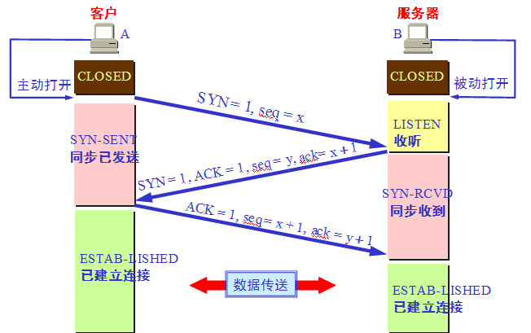
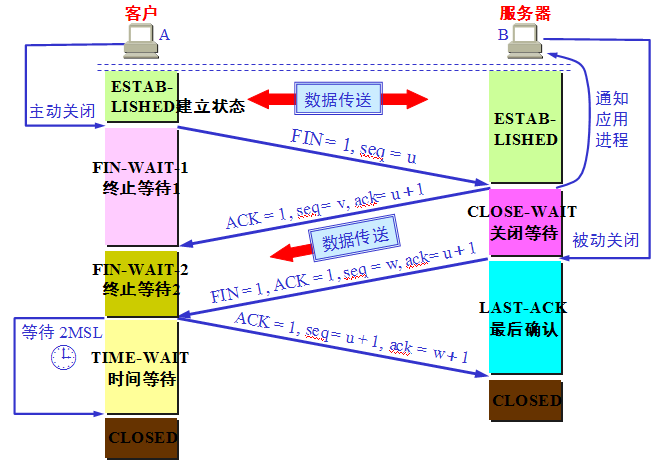

## 1.引言
学了忘，忘了学，再来整理下TCP相关的知识。

## 2.TCP连接建立
 

上图画出了 TCP 建立连接的过程。假定主机 A 是 TCP 客户端，B是服务端。最初两端的 TCP 进程都处于 CLOSED 状态。图中在主机下面的是 TCP进程所处的状态。A 是主动打开连接，B 是被动打开连接。
### 三次握手过程分析
1. 首先A向B发出连接请求报文段，这时首部中的同步位SYN=1，同时选择一个初始序号 seq=x。TCP规定，SYN报文段不能携带数据，但要消耗掉一个序号。这时，A进入SYN-SENT状态。【备注：序号指的是 TCP 报文段首部20字节里的序号，TCP 连接传送的字节流的每一个字节都按顺序编号，具体可以看看 TCP 可靠传输实现的原理】 
2. B收到请求后，向A发送确认。在确认报文段中把SYN和ACK位都置为1，确认号是ack=x+1,同时也为自己选择一个初始序号seq=y。请注意，这个报文段也不能携带数据，但同样要消耗掉一个序号。这时B进入SYN-RCVD状态。 
3. A收到B的确认后，还要向B给出确认。确认报文段的ACK置为1，确认号ack=y+1，而自己的序号seq=x+1。这时，TCP连接已经建立，A进入ESTABLISHED 状态，当B收到A的确认后，也会进入 ESTABLISHED 状态。
### 为什么需要三次握手？
**为防止client已失效的连接请求报文段传送至server，导致连接错误。**

所谓已失效的连接请求报文段是这样产生的。A发送连接请求，但因连接请求报文丢失而未收到确认，于是A重发一次连接请求，成功后建立了连接。数据传输完毕后就释放了连接。

发送方A的发出第一条请求报文，未收到接收方B的回复，于是进行重传第二条请求报文，这时可以正常接受到回复报文。问题就出在这第一条失踪的请求报文，如果采用二次握手，则会有一种情况，失踪的第一条请求报文在连接关闭后再次到达了接收方B，接收方B会误以为发送方申请连接，发送确认报文回去，此时发送方A由于并未发出建立连接请求，因此不会回复，B却苦等，造成资源浪费。

TCP三次握手则可以防止上述现象发生。
### 如果在TCP第三次握手中的报文段丢失了会发生什么情况?
Client认为这个连接已经建立，如果Client端向Server写数据，Server端将以RST包响应，方能感知到Server的错误。

## 3.TCP连接断开
 

### 四次挥手过程分析
1. 客户端 A 的 TCP 进程先向服务端发出连接释放报文段，并停止发送数据，主动关闭 TCP 连接。释放连接报文段中 FIN=1，序号为 seq=u，该序号等于前面已经传送过去的数据的最后一个字节的序号加1。这时，A进入 FIN—WAIT-1 (终止等待1)状态，等待 B 的确认。TCP 规定，FIN报文段即使不携带数据，也要消耗掉一个序号。这是 TCP 连接释放的第一次挥手。 
2. B收到连接释放报文段后即发出确认释放连接的报文段，该报文段中，ACK=1，确认号为ack=u+1，其自己的序号为v，该序号等于B前面已经传送过的数据的最后一个字节的序号加1。然后B进入CLOSE—WAIT(关闭等待)状态，此时TCP服务器进程应该通知上层的应用进程，因而A到B这个方向的连接就释放了，这时TCP处于半关闭状态，即A已经没有数据要发了，但B若发送数据，A仍要接受，也就是说从B到A这个方向的连接并没有关闭，这个状态可能会持续一些时间。这是TCP连接释放的第二次挥手。
3. A收到B的确认后，就进入了FIN—WAIT(终止等待2)状态，等待B发出连接释放报文段，如果B已经没有要向A发送的数据了，其应用进程就通知TCP释放连接。这时B发出的链接释放报文段中，FIN=1，确认号还必须重复上次已发送过的确认号，即ack=u+1，序号seq=w，因为在半关闭状态B可能又发送了一些数据，因此该序号为半关闭状态发送的数据的最后一个字节的序号加1。这时B进入LAST—ACK(最后确认)状态，等待A的确认，这是TCP连接的第三次挥手。
4. A收到B的连接释放请求后，必须对此发出确认。确认报文段中，ACK=1，确认号ack=w+1，而自己的序号seq=u+1，而后进入TIME—WAIT(时间等待)状态。这时候，TCP连接还没有释放掉，必须经过时间等待计时器设置的时间2MSL后，A才进入CLOSED状态，时间MSL叫做最长报文寿命，RFC建议设为2分钟，因此从A进入TIME—WAIT状态后，要经过4分钟才能进入到CLOSED状态，而B只要收到了A的确认后，就进入了CLOSED状态。二者都进入CLOSED状态后，连接就完全释放了，这是TCP连接的第四次挥手。

### 为什么需要四次挥手？
1. 为了保证A发送的最后一个ACK报文段能够到达B。即最后这个确认报文段很有可能丢失，那么B会超时重传，然后A再一次确认，同时启动2MSL计时器，如此下去。如果没有等待时间，发送完确认报文段就立即释放连接的话，B就无法重传了（连接已被释放，任何数据都不能出传了），因而也就收不到确认，就无法按照步骤进入CLOSE状态，即必须收到确认才能close。 
2. 防止“已失效的连接请求报文段”出现在连接中。经过2MSL，那些在这个连接持续的时间内，产生的所有报文段就可以都从网络中消失。即在这个连接释放的过程中会有一些无效的报文段滞留在楼阁结点，但是呢，经过2MSL这些无效报文段就肯定可以发送到目的地，不会滞留在网络中。这样的话，在下一个连接中就不会出现上一个连接遗留下来的请求报文段了。

## 4.TCP的有限状态机
 

上图是 TCP 的状态机，看了很久，感觉还是理解得不深。先在这里打个点。

（1）CLOSED 状态时初始状态。

（2）LISTEN:被动打开，服务器端的 状态变为LISTEN(监听)。被动打开的概念：连接的一端的应用程序通知操作系统，希望建立一个传入的连接。这时候操作系统为连接的这一端建立一个连 接。与之对应的是主动连接：应用程序通过主动打开请求来告诉操作系统建立一个连接。

（3）SYNRECVD:服务器端收到SYN后，状态为SYN；发送SYN ACK;

（4）SYN_SENTY:应用程序发送SYN后，状态为SYN_SENT；

（5）ESTABLISHED:SYNRECVD收到ACK后，状态为ESTABLISHED； SYN_SENT在收到SYN ACK，发送ACK，状态为ESTABLISHED；

（6）CLOSE_WAIT:服务器端在收到FIN后，发送ACK，状态为CLOSE_WAIT；如果此时服务器端还有数据需要发送，那么就发送，直到数据发送完毕；此时，服务器端发送FIN，状态变为LAST_ACK;

（7）FIN_WAIT_1：应用程序端发送FIN，准备断开TCP连接；状态从ESTABLISHED——>FIN_WAIT_1；

（8）FIN_WAIT_2：应用程序端只收到服务器端得ACK信号，并没有收到FIN信号；说明服务器端还有数据传输，那么此时为半连接；

（9）TIME_WAIT:有两种方式进入 该状态：1、FIN_WAIT_1进入：此时应用程序端口收到FIN+ACK（而不是像FIN_WAIT_2那样只收到ACK，说明数据已经发送完毕）并 向服务器端口发送ACK；2、FIN_WAIT_2进入：此时应用程序端口收到了FIN，然后向服务器端发送ACK；TIME_WAIT是为了实现TCP 全双工连接的可靠性关闭，用来重发可能丢失的ACK报文；需要持续2个MSL(最大报文生存时间)：假设应用程序端口在进入TIME_WAIT后，2个 MSL时间内并没有收到FIN,说明应用程序最后发出的ACK已经收到了；否则，会在2个MSL内在此收到ACK报文；

### 4.1 客户端应用程序的状态迁移图 
客户端的状态可以用如下的流程来表示： 
CLOSED->SYN_SENT->ESTABLISHED->FIN_WAIT_1->FIN_WAIT_2->TIME_WAIT->CLOSED 
以上流程是在程序正常的情况下应该有的流程，从书中的图中可以看到，在建立连接时，当客户端收到SYN报文的ACK以后，客户端就打开了数据交互地连接。而结束连接则通常是客户端主动结束的，客户端结束应用程序以后，需要经历FIN_WAIT_1，FIN_WAIT_2等状态，这些状态的迁移就是前面提到的结束连接的四次握手。

### 4.2 服务器的状态迁移图 
服务器的状态可以用如下的流程来表示： 
CLOSED->LISTEN->SYN收到->ESTABLISHED->CLOSE_WAIT->LAST_ACK->CLOSED 
在建立连接的时候，服务器端是在第三次握手之后才进入数据交互状态，而关闭连接则是在关闭连接的第二次握手以后（注意不是第四次）。而关闭以后还要等待客户端给出最后的ACK包才能进入初始的状态。

### 4.3 其他状态迁移 
书中的图还有一些其他的状态迁移，这些状态迁移针对服务器和客户端两方面的总结如下 
LISTEN->SYN_SENT，对于这个解释就很简单了，服务器有时候也要打开连接的嘛。 
SYN_SENT->SYN收到，服务器和客户端在SYN_SENT状态下如果收到SYN数据报，则都需要发送SYN的ACK数据报并把自己的状态调整到SYN收到状态，准备进入ESTABLISHED 
SYN_SENT->CLOSED，在发送超时的情况下，会返回到CLOSED状态。 
SYN_收到->LISTEN，如果受到RST包，会返回到LISTEN状态。 
SYN_收到->FIN_WAIT_1，这个迁移是说，可以不用到ESTABLISHED状态，而可以直接跳转到FIN_WAIT_1状态并等待关闭。

### 4.4 2MSL等待状态 
书中给的图里面，有一个TIME_WAIT等待状态，这个状态又叫做2MSL状态，说的是在TIME_WAIT2发送了最后一个ACK数据报以后，要进入TIME_WAIT状态，这个状态是防止最后一次握手的数据报没有传送到对方那里而准备的（注意这不是四次握手，这是第四次握手的保险状态）。这个状态在很大程度上保证了双方都可以正常结束，但是，问题也来了。

由于插口的2MSL状态（插口是IP和端口对的意思，socket），使得应用程序在2MSL时间内是无法再次使用同一个插口的，对于客户程序还好一些，但是对于服务程序，例如httpd，它总是要使用同一个端口来进行服务，而在2MSL时间内，启动httpd就会出现错误（插口被使用）。为了避免这个错误，服务器给出了一个平静时间的概念，这是说在2MSL时间内，虽然可以重新启动服务器，但是这个服务器还是要平静的等待2MSL时间的过去才能进行下一次连接。

### 4.5 FIN_WAIT_2状态 
这就是著名的半关闭的状态了，这是在关闭连接时，客户端和服务器两次握手之后的状态。在这个状态下，应用程序还有接受数据的能力，但是已经无法发送数据，但是也有一种可能是，客户端一直处于FIN_WAIT_2状态，而服务器则一直处于WAIT_CLOSE状态，而直到应用层来决定关闭这个状态。 

### 4.6 RST，同时打开和同时关闭 
RST是另一种关闭连接的方式，应用程序应该可以判断RST包的真实性，即是否为异常中止。而同时打开和同时关闭则是两种特殊的TCP状态，发生的概率很小。
